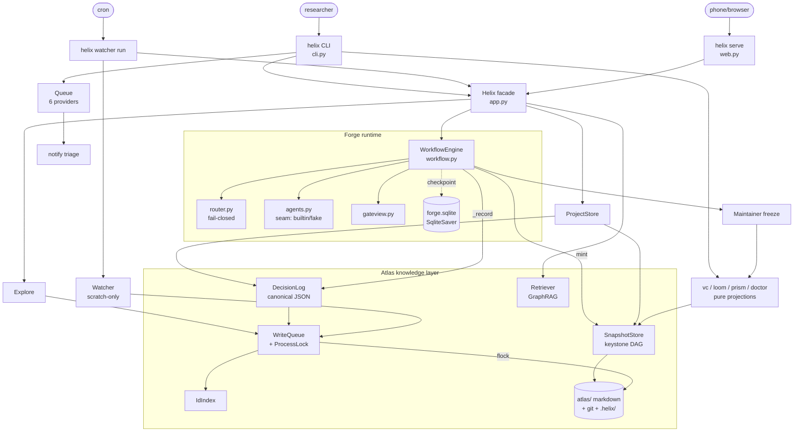

# Helix — Architecture (as-built)

> **Relationship to `HELIX.md`.** `HELIX.md` is the authoritative system
> specification and the single source of truth. This document is the
> *as-built map* of the current code: it states what exists and how it
> wires together, and cites spec sections (`§`) rather than restating
> design rationale. Where code and spec diverge, the spec wins and the
> divergence is an "Open question" below — not a silent doc choice.

## System summary

Helix is a two-layer research co-pilot for solo researchers. **Forge**
is the workflow runtime — a LangGraph agent graph that drives a project
from idea to publication with human-in-the-loop gates. **Atlas** is the
durable knowledge layer — markdown pages in a git-tracked tree with a
canonical, append-only decision log. There is no server or daemon: the
only entry point is the `helix` CLI; a cron-wrapped `helix watcher run`
and an opt-in `helix serve` web view are *separate processes* that share
the same on-disk Atlas, serialized by a cross-process file lock. All
durable state lives under `$HELIX_HOME` (default `~/.helix`); no
external services are required for the default path (§11.1).

## Component inventory

External-integration adapters (FutureHouse, Claude Code, LangSmith,
Postgres, DVC) are **declared seams, not implemented** — selecting one
unconfigured fails closed with instructions (`upgrades.py`, §11.1).

### Wiring & entry

| Name | Path | Responsibility | Key deps |
|---|---|---|---|
| CLI | `src/helix/cli.py` | The only entry point (`helix` → `main`); ~43 commands/groups; builds the queue; renders gate views; `helix serve` runs the web process | `click`, `app`, every subsystem |
| App facade | `src/helix/app.py` | `Helix` — the single wiring path; constructs all stores; threads the shared write lock; `workflow()`/`explorer()` seam factories; config at `$HELIX_HOME` | all stores |

### Atlas — knowledge layer (`src/helix/atlas/`, plus ids/pages)

| Name | Path | Responsibility | Key deps |
|---|---|---|---|
| Page model | `src/helix/pages.py` | YAML-frontmatter markdown page; `generated`/`private` banners (§6.2, §7.2, §9.9) | `pyyaml` |
| Id index | `src/helix/ids.py` | Stable uuid/handle ↔ path resolution so moves never break refs (§6.2) | — |
| Store | `src/helix/atlas/store.py` | Filesystem layout (`AtlasLayout`) + atomic page IO | `ids`, `pages` |
| Process lock | `src/helix/atlas/proclock.py` | Re-entrant `RLock` + `fcntl.flock` on `.helix/write.lock` — **cross-process** single-writer (§6.4.1, §7) | `fcntl` |
| Write queue | `src/helix/atlas/writequeue.py` | The one ordered writer: optimistic concurrency, WAL, link hygiene, generated-file fold (§6.4.1, §8.6) | `proclock`, `store`, `graph` |
| Graph | `src/helix/atlas/graph.py` | `[[wikilink]]` extraction + adjacency over Atlas (§8.1) | `store` |
| Retriever | `src/helix/atlas/retriever.py` | GraphRAG: BM25 anchors, hop BFS, hub cap, cold-start, 3-tier budget (§8.2–8.6) | `graph`, `store` |
| Lint | `src/helix/atlas/lint.py` | Continuous + full-sweep lint: broken/dup/orphan/stale-provenance (§6.4) | `graph`, `store` |
| Decision log | `src/helix/decisionlog.py` | **Canonical** structured JSON + deterministic narrative projection (§7.1–7.2) | `writequeue` |
| Snapshot | `src/helix/snapshot.py` | Composite-commit keystone + branches; `project_atlas_binding` (§7.3–7.5) | `store` |
| CAS | `src/helix/cas.py` | Content-addressed data store; hashes bound into Snapshots (§7.6) | — |

### Forge — workflow runtime (`src/helix/forge/`)

| Name | Path | Responsibility | Key deps |
|---|---|---|---|
| State | `src/helix/forge/state.py` | `ForgeState` (LangGraph schema), autonomy modes, severity enum (§5.5) | — |
| Router | `src/helix/forge/router.py` | Pure fail-closed gate/sanity routing + enforced budget (§5.3–5.5) | `state` |
| Trust | `src/helix/forge/trust.py` | Gate-agreement telemetry → autonomy suggestions/auto-demote (§5.6) | `state` |
| Agents | `src/helix/forge/agents.py` | Agent-body seam: deterministic built-ins + `FakeAgents` (§5.1, §11.1) | `explore` |
| Gate view | `src/helix/forge/gateview.py` | Progressive-disclosure gate payload: why/confidence/teach-back/co-sign/compare (§9.3, §7.4) | `router`, `decisionlog` |
| Workflow | `src/helix/forge/workflow.py` | LangGraph `StateGraph` wiring + `WorkflowEngine`; HITL via `interrupt`; `SqliteSaver` checkpoint (§5.2) | `langgraph`, all of forge |

### Knowledge & lifecycle operations

| Name | Path | Responsibility | Key deps |
|---|---|---|---|
| Project store | `src/helix/project.py` | Per-project meta + lifecycle ladder; tier change = decision + Snapshot (§9.4) | `app`, `snapshot` |
| Routing config | `src/helix/routing.py` | `models.toml` resolver: per-step/role/project/global, privacy override, fail-closed (§11.2) | `tomllib` |
| Explore | `src/helix/explore.py` | Front door / Scout body: arXiv (real) or fake backend; ingests to scratch (§5.1, §9.10) | `urllib`, `retriever` |
| VC | `src/helix/vc.py` | `diff/history/checkout/repro/bisect/fork` over Snapshots (§7.5) | `snapshot`, `loom`, `prism` |
| Loom | `src/helix/loom.py` | Project-map projection — TTY (glyph-authoritative) + SVG (§7.7) | `snapshot`, `decisionlog` |
| Prism | `src/helix/prism.py` | Project-anatomy projection — fixed Strategy→Data→Code (§7.8) | `decisionlog` |
| Salvage | `src/helix/salvage.py` | Dead-end learning → canonical w/ provenance; privacy-aware (§6.4, §9.9) | `snapshot`, `writequeue` |
| Maintainer | `src/helix/maintainer.py` | Freeze: lint+repro+drafts+supplement; promotion-as-suggestion; co-sign block (§5.1, §9.4, §13) | `vc`, `lint`, `loom`, `prism` |
| Doctor | `src/helix/doctor.py` | One cross-layer diagnostic (§9.11) | `snapshot`, `lint`, `prism` |

### Surfaces, cross-cutting, upgrades

| Name | Path | Responsibility | Key deps |
|---|---|---|---|
| Queue | `src/helix/queue.py` | The one mental model; 6 registered providers → 3 buckets (§9.0–9.1) | per-subsystem |
| Notify | `src/helix/notify.py` | Triage: blocking-only push, batched digest, badge, quiet hours (§9.5) | `queue` |
| Catch-up | `src/helix/catchup.py` | >24h-idle per-project digest; idle cursor is view-state (§9.6) | `decisionlog` |
| Privacy | `src/helix/privacy.py` | Strict-mode degradation + directional canonical write boundary (§9.9) | `routing`, `projects` |
| Co-sign | `src/helix/cosign.py` | Opt-in PI attestation; Maintainer freeze-block (§13, §9.3) | `decisionlog`, `snapshot` |
| Watcher | `src/helix/watcher.py` | Async passive enrichment, off by default; scratch-only proposals (§5.1, §6.4.1) | `explore`, `retriever` |
| Web view | `src/helix/web.py` | Zero-dep stdlib token-paired gate view (§11, §7.7.3) | `http.server` |
| Upgrades | `src/helix/upgrades.py` | Opt-in registry + honest fail-closed adapters (§11.1) | — |

## Runtime boundaries

Three processes, **no supervisor/daemon** — coordination is purely the
shared filesystem + lock:

1. **Interactive CLI** (`helix …`) — short-lived; constructs one `Helix`
   facade per invocation.
2. **Cron Watcher** (`helix watcher run`, user-cron-wrapped) — separate
   process; ingests to `scratch/` only; never writes behind an in-flight
   project (§6.4.1).
3. **Web view** (`helix serve`) — separate `ThreadingHTTPServer`
   process; loopback, token-paired (token auth is *advisory, not a
   security boundary* per code).

Boundary contracts:
- **Cross-process single writer**: every Atlas write (pages, decision
  log, snapshots, project meta) passes through `WriteQueue._lock`
  (`ProcessLock` = `RLock` + `flock` on `.helix/write.lock`).
  `DecisionLog`/`SnapshotStore`/`ProjectStore` serialize on the *same*
  lock instance (threaded via `app.py`). Verified by `tests/test_crossproc.py`.
- **Workflow checkpoint**: each project is a LangGraph thread
  (`thread_id = project`) checkpointed in `$HELIX_HOME/forge.sqlite`
  (`SqliteSaver`); gates `interrupt()` and are resumed by a possibly
  different process.

## On-disk data stores (under `$HELIX_HOME`)

| Path | Contents |
|---|---|
| `models.toml`, `config.json` | Routing config; facade config (`atlas_root`, `quiet_hours`, …) |
| `forge.sqlite` | LangGraph workflow checkpoints (one thread per project) |
| `atlas/` | Git-tracked markdown: `concepts/ methods/ sources/ scratch/ projects/ archive/` + `ATLAS.md` |
| `atlas/.helix/index.json` | uuid/handle → path + version index |
| `atlas/.helix/wal.jsonl` | Write-ahead log of every intent + outcome |
| `atlas/.helix/write.lock` | `fcntl` advisory cross-process write lock |
| `atlas/.helix/cas/` | Content-addressed data blobs (§7.6) |
| `atlas/.helix/{watcher,explore}/`, `loom-cursor.json`, `web-token` | Watcher state/proposals; explore results; view cursors; web token |
| `atlas/projects/<n>/.decision-log.json` | **Canonical** decision log |
| `atlas/projects/<n>/decision-log-narrative.md` | Generated projection (never edited directly) |
| `atlas/projects/<n>/.snapshots/{<seq>.json, refs.json}` | Snapshot DAG + branch refs |

## Data flows (the 3 most important user-facing operations)

### A. First value: `setup → explore → init → run → resolve → freeze`

```
helix setup            → writes models.toml; prints upgrade registry
helix explore "<q>"    → app.explorer() (arXiv|fake) → source pages to scratch/
                         → ExploreStore record → queue FYI "Explore done"
helix init <n> --from-think
                         → ProjectStore.create: meta + overview page
                           + "init" decision (DecisionLog) + Snapshot@1
helix run <n>          → WorkflowEngine.start: StateGraph from START→scout
                           → gate_scope … runs nodes until a gate interrupt()s
                           → state checkpointed to forge.sqlite; queue shows
                             NEEDS-YOU (workflow_gate_provider)
helix <n> [--approve|--option …|--cosign --as <pi>]
                         → WorkflowEngine.resume(Command(resume=…))
                           → each gate: router.gate_decision (fail-closed)
                           → _record(): DecisionLog.append + Snapshot.mint
                             (binds code_sha + atlas_pages + data_hashes + routing)
                           → loops scout→…→critic_results→maintainer
helix freeze <n>       → Maintainer.freeze: full lint + repro.md + Methods/
                           Limitations/rebuttals/BibTeX drafts + Loom/Prism
                           supplement; blocked if PI co-sign pending (§13)
```
Autonomy modes (§5.3) decide which gates `interrupt()` vs auto-approve;
`always_ask` (default) pauses every gate.

### B. The canonical write path (load-bearing, every subsystem uses it)

```
caller builds Intent(op=create|update|upsert|set_status|ingest_human_edit)
  → WriteQueue.submit():
      acquire ProcessLock          # cross-process single writer
      WAL append {intent, pending}
      _apply():
        link hygiene (reject dangling links on authored pages, §8.6)
        write page file (atomic tmp+replace) + IdIndex update
        on set_status: relocate file, id/handle stable (refs survive)
      WAL append {outcome}
      IdIndex.save() (atomic)
      on_applied → incremental lint of touched page (best-effort)
      release ProcessLock
DecisionLog.append() and SnapshotStore.mint() take the SAME lock;
the narrative / Loom / Prism are pure deterministic re-projections of
the canonical JSON — never a second source of truth (§7.1–7.2).
```

### C. The async Watcher pass (separate process, off by default)

```
helix watcher schedule "<cron>"   → WatcherStore.enable; prints crontab line
(cron) helix watcher run          → if disabled: no-op (honest)
   for each watched query (+ active projects):
     backend.search (arXiv|fake)   → dedupe vs seen-cursor
     ingest NEW papers as scratch/ source pages via WriteQueue (scratch only)
     overlap vs canonical (Retriever) → Proposal; deferred if project in-flight
   proposals persisted → queue FYI (watcher_fyi_provider, batched by notify)
helix watcher apply <id>          → fold into canonical (blocked if privacy
                                    strict or project in-flight, §6.4.1/§9.9)
```

## Component & relationship diagram



## Open questions

These are genuine ambiguities/undocumented areas in the code as it
stands — flagged rather than guessed:

1. **Spec vs. as-built drift.** `HELIX.md` already contains an
   architecture narrative. This doc deliberately defers to it and cites
   `§`s; there is no automated check that the two stay consistent. How
   should drift be prevented (e.g. a CI check, or treat `HELIX.md` as
   normative and this as generated)?
2. **Process model / "services".** Watcher and web are separate
   processes with **no supervisor, health check, or daemon**; the
   Watcher relies on a user-installed crontab line and the web server is
   loopback-only. There is no documented production/deployment topology.
3. **Web token auth.** `web.py` self-documents the token as *advisory,
   not a security boundary*. The intended trust model for any
   non-loopback exposure is undocumented.
4. **Deferred capabilities.** Loom/Prism emit TTY+SVG only (PDF and
   interactive-web are "v1.5" in code comments); external upgrade
   adapters are fail-closed seams only. These are represented as seams
   here — confirm that treatment is acceptable for downstream docs
   (Steps 2–4) rather than documenting them as working features.
5. **`atlas_root` relocation.** `app.py` reads `config["atlas_root"]`
   so Atlas can live outside `$HELIX_HOME`, but `forge.sqlite`,
   `models.toml`, and `config.json` always sit at `$HELIX_HOME`. The
   intended behavior when these diverge (e.g. shared Atlas, per-user
   home) is unspecified.
